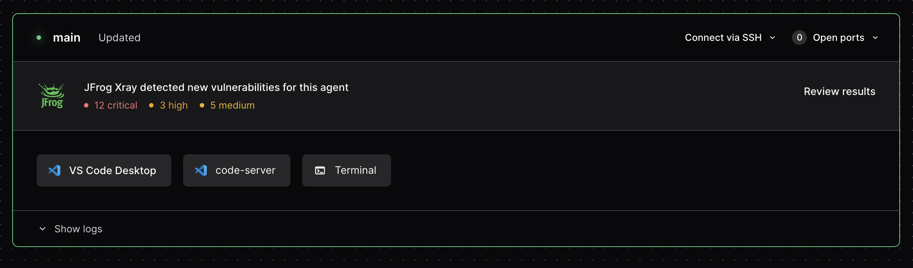

> [!CAUTION]
> This integration is no longer supported in [Coder](https://github.com/coder/coder) as of `v2.22.0`

# coder-xray

[](https://github.com/coder/coder-xray/pkgs/container/coder-xray)
[](./LICENSE)

- Query Artifactory for image vulnerability on workspace startup.
- Inform users when they are using a vulnerable image.



## Usage

Apply the Helm chart to start monitoring workspaces:

```console
helm repo add coder-xray https://helm.coder.com/coder-xray
    --namespace coder \
helm install coder-xray coder-xray/coder-xray \
	--set coder.url="https://<your-coder-url>" \
	--set coder.secretName="<your coder token secret>" \
	--set artifactory.url="https://<your-artifactory-url>" \
	--set artifactory.secretName="<your artifactory secret>"
```

For a detailed step by step guide, see the [scanning coder workspaces with xray](https://coder.com/docs/guides/xray-integration) guide.

> **Note**
> For additional customization (such as customizing the image, details on creating a secret, etc.), you can use the
> [values.yaml](https://github.com/coder/coder-xray/blob/main/helm/values.yaml) file directly.

### Requirements:

In order to use this service the following is required:

- A Coder API token with _at least_ Template Admin privileges
- An Artifactory token

## How?

Kubernetes provides an [informers](https://pkg.go.dev/k8s.io/client-go/informers) API that streams pod and event data from the API server.

`coder-xray` listens for pod creation events with containers that have the `CODER_AGENT_TOKEN` environment
variable set. All matching pods/containers are then queried against the provided Artifactory instance and
any XRay results are then pushed to the provided Coder deployment. 
